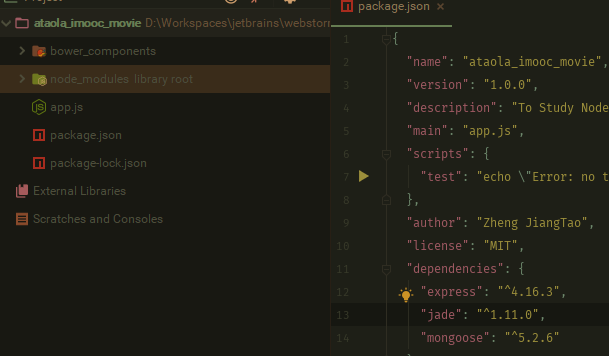
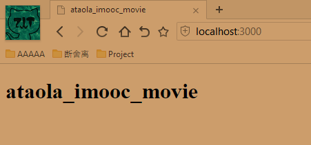
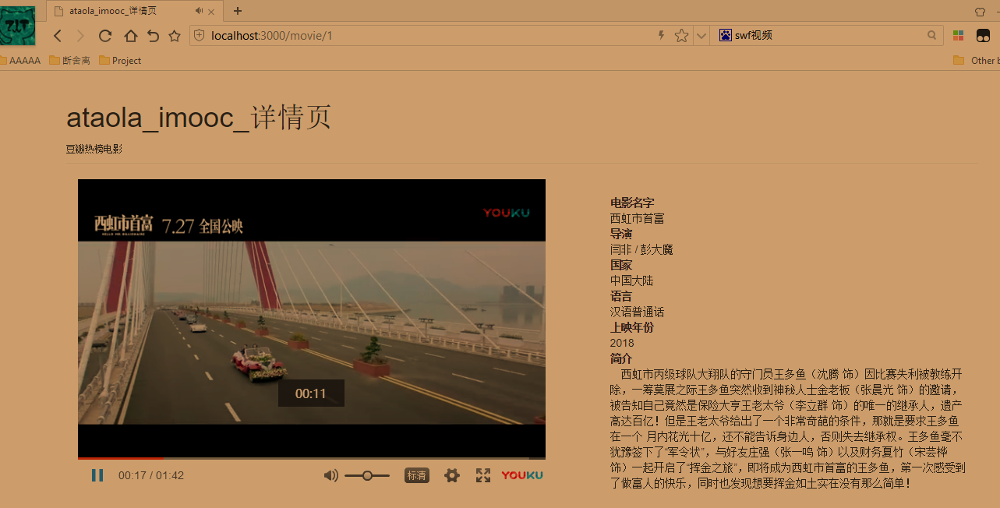
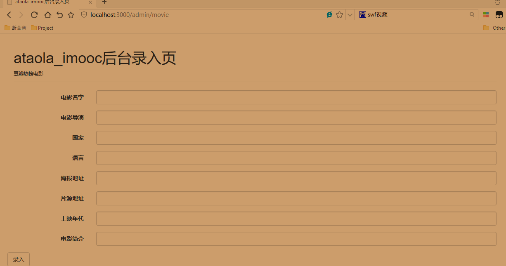

# ataola_imooc_movie :blush:
## 说明:
这个是阿涛在看了慕课大佬scott老师的视频后，自己跟着做的基于NodeJS和mongoDB的
小网站

## Explain
This is a small website where ataola watched the video of imooc Scott teacher, followed by NodeJS and mongoDB.

## 项目知识点一览表(Project Table)

### 服务端(Server)
NodeJS+Express(jade)
### 数据库(database)
mongoDB+mongoose
### 包库管理(package manage)
npm

### 前端(Front end)
Jquery+Bootstrap
### 管理工具(manage tools)
bower
### 构建工具(build tools)
grunt
### 本地环境(local Environment)
less(cssmin)+JSHint(UglifeJS)+mocha(nodemon)

### 项目目录（Project Catalog)


### 视图(View)
基于jade模板的视图创建，总共是四个，一个是首页index，一个是后台admin，
一个是列表页list，一个是详细页detail，这个要注意的就是排列，可能有空格会错误，
不过webstorm这种神器一看就知道错没错，下面放一个模板,jade的语法不会的Google吧，
有html基础的应该很好理解
```
doctype
html
    head
        meta(charset="utf-8")
        title #{title}
    body
        h1 #{title}
```

### 路由控制(Routing control)
这里没有按照视频上的，自己用了es6的语法，具体的以首页为例
```
   app.get('/',(req,res)=>{
      res.render('index',{title:'ataola_imooc_movie'});
   });
```
效果如下：:point_down:



### 伪造页面数据测试jade渲染的前端模板
*这里的数据并不是按照老师教程事先准备好的，而是去豆瓣抓取的，谈起为什么这么做，因为什么事都不可能凑的那么好，我们学技术就应该应用到生活实战里去*

结果可想而知，因为豆瓣的图片事webp格式的，而且每张图片的大小略微有点不一样，而bootstrap布局又是写死的，这就会对页面造成布局破坏
下面看下凉凉的效果 :joy:

这个是凉凉版的首页 :broken_heart:


凉凉版的详细页 :broken_heart:


但神奇的是，当你F12看下移动端的效果时，天啦噜，居然还较为满意的 :innocent:


**结果分析：** 产生这个现象的原因时Bootstrap3（我们这里开发时3的版本，默认bower不指定都是最新的4这里注意下）
Bootstrap内部是12栅格系统，scott老师视频中是给div的class设置col-md-2,这样的话我们可以想象，一行中可以排列六张图，若图片的宽高超过div父元素必天下打乱，
第二个是为什么也不尽人意，按照col-md 5+7刚好是12啊，原因是因为给swf视频设置的宽高超过了div，设置小点就好。

正确的打开姿势是首页设置成功col-md-4，即每行三个，如图：


详细页视图：



数据插入页效果：



好啦，至此模拟假数据仿真的页面完成了 :satisfied:


