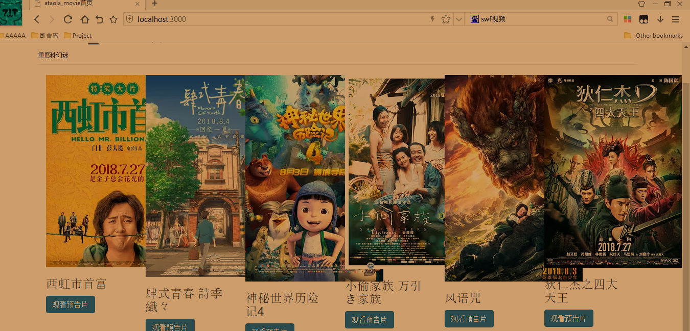

# ataola_imooc_movie :blush:
## 说明:
这个是阿涛在看了慕课大佬scott老师的视频后，自己跟着做的基于NodeJS和mongoDB的
小网站

## Explain
This is a small website where ataola watched the video of imooc Scott teacher, followed by NodeJS and mongoDB.

## 项目知识点一览表(Project Table)

### 服务端(Server)
NodeJS+Express(jade)
### 数据库(database)
mongoDB+mongoose
### 包库管理(package manage)
npm

### 前端(Front end)
Jquery+Bootstrap
### 管理工具(manage tools)
bower
### 构建工具(build tools)
grunt
### 本地环境(local Environment)
less(cssmin)+JSHint(UglifeJS)+mocha(nodemon)

### 项目目录（Project Catalog)


### 视图(View)
基于jade模板的视图创建，总共是四个，一个是首页index，一个是后台admin，
一个是列表页list，一个是详细页detail，这个要注意的就是排列，可能有空格会错误，
不过webstorm这种神器一看就知道错没错，下面放一个模板,jade的语法不会的Google吧，
有html基础的应该很好理解
```
doctype
html
    head
        meta(charset="utf-8")
        title #{title}
    body
        h1 #{title}
```

### 路由控制(Routing control)
这里没有按照视频上的，自己用了es6的语法，具体的以首页为例
```
   app.get('/',(req,res)=>{
      res.render('index',{title:'ataola_imooc_movie'});
   });
```
效果如下：:point_down:


### 伪造页面数据测试jade渲染的前端模板
*这里的数据并不是按照老师教程事先准备好的，而是去豆瓣抓取的，谈起为什么这么做，因为什么事都不可能凑的那么好，我们学技术就应该应用到生活实战里去*

结果可想而知，因为豆瓣的图片事webp格式的，而且每张图片的大小略微有点不一样，而bootstrap布局又是写死的，这就会对页面造成布局破坏
下面看下凉凉的效果 :joy:

这个是凉凉版的首页 :broken_heart:



凉凉版的详细页 :broken_heart:


但神奇的是，当你F12看下移动端的效果时，天啦噜，居然还较为满意的 :innocent:


**结果分析：** 产生这个现象的原因时Bootstrap3（我们这里开发时3的版本，默认bower不指定都是最新的4这里注意下）
Bootstrap内部是12栅格系统，scott老师视频中是给div的class设置col-md-2,这样的话我们可以想象，一行中可以排列六张图，若图片的宽高超过div父元素必天下打乱，
第二个是为什么也不尽人意，按照col-md 5+7刚好是12啊，原因是因为给swf视频设置的宽高超过了div，设置小点就好。

正确的打开姿势是首页设置成功col-md-4，即每行三个，如图：


详细页视图：


数据插入页效果：


好啦，至此模拟假数据仿真的页面完成了 :satisfied:

### 关于mongodb数据库操作

**整体思路:** 这里我们用的是mongoose， 通过Schema定义模式，然后通过model来
编译模型，最后通过Document进行文档实例化来对mongodb进行数据库操作

这里mongoose的数据库的连接时这样子的：
```
    var mongoose=require('mongoose');
    mongoose.connect('mongodb://localhost/ataola_imooc_movie');
```

因为昨天又去重温了一遍《无间道》，里面的台词还是那么经典，那么耐人寻味，所以就用它来测试吧，
先放一张影帝大大的照片镇楼


我们先打开录入页，也就是http://localhost:3000/movie/new


点击录入后，我们可以看到mongodb数据库里的结果


它会重定向到详情页


然后我们进入列表页看下，发现多了条结果


我们点击更新跳到更新页，我们把它改成2003年大陆上映的中文版


最后我们看到结果时改变了


关于列表页数据的删除

首先我们思考一个问题，把bower管理的包库写在bower_components里，当我要写自己的逻辑的时候
js引入有点烦，所有我们新建一个.bowerrc文件里面的directory参数来安装库文件这里是public文件夹下的libs
然后我们需要再app.js入口文件的静态文件改下，然后在head.jade和list.jade改下引入路径，这里注意你在list.jade
引入自己的js，先回车另起一行然后空四格，自己写好后，然后再app.js里写删除的路由。

下面是删除测试用例结果：


至此慕课一期项目已经完毕，我们知道路漫漫其修远兮，还有权限控制以及一些细节还需要细化，敬请期待更新吧！

**如何运行这个项目：**

第一步：git clone https://github.com/zjt613/ataola_imooc_movie.git

第二步：bower install && npm install 

第三步：打开浏览器喽

谢谢观赏 :blush:


